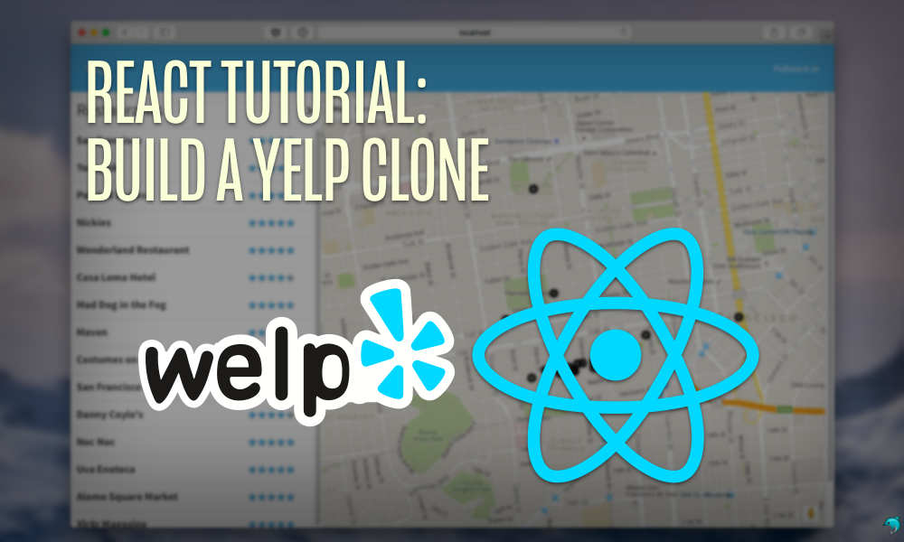
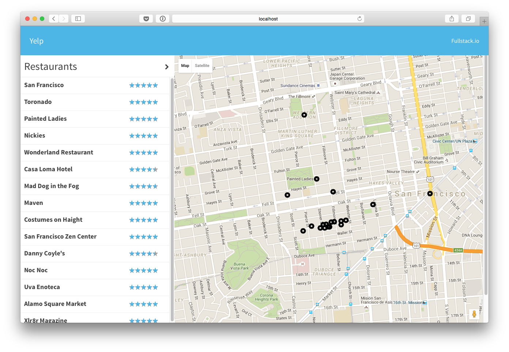

<p align="center">
  
</p>

# React Tutorial: Build a Yelp Clone [](https://www.fullstackreact.com)

> _tl;dr_ - This is the code for our blog post which will guide you through building a full React app, even with little to no experience in the framework. We're going build a Yelp clone in React

See the [demo](http://fullstackio.github.io/yelp-clone) and [accompanying blog post](https://www.fullstackreact.com/articles/react-tutorial-cloning-yelp/).

Let's build a lightweight clone of Yelp using React.

In this tutorial we'll talk about:

- How to setup a new React project from scratch
- How to create a basic React component
- How to write modular CSS using `postcss`
- How to setup testing
- How route to different pages with `react-router`
- How to integrate with Google Maps
- How to write a Google Maps React component
- How to write a five-star rating component

We'll be tying in a lot of different pieces of [React](https://facebook.github.io/react/) together to build a full-sized React app. This post will guide you through building a full React app, even with little to no experience in the framework.

<p align="center">
  
</p>

## Quickstart

First, clone the repository:

```bash
git clone https://github.com/fullstackreact/react-yelp-clone.git react-yelp-clone
cd react-yelp-clone

# install the dependencies
npm install

# copy configuration (see below)
cp .env.example .env

# start the server
npm start
```

## Configuring the Application

This app uses [dotenv](https://github.com/bkeepers/dotenv) for configuration. In order to configure the application for your own api access, [grab an api token from Google here](https://developers.google.com/maps/documentation/javascript/) and set it in a file called `.env` at the root for a key called `__GAPI_KEY__`.
For instance, say that your gapi key is: `abc123`. Your `.env` file should look like:

```bash
GAPI_KEY=abc123
```

You can also create this file by copying the `.env.example` file at the root:

```bash
cp .env.example .env
```

## Starting the Application

```bash
npm install 
npm start
```

## Libraries We'll Use

This app uses the following technologies:

* [webpack](https://webpack.github.io)
* [postcss](http://postcss.org)
* [hjs-webpack](https://github.com/HenrikJoreteg/hjs-webpack)
* [react.js](http://facebook.github.io/react/)
* [react-router](https://github.com/reactjs/react-router)
* [Google Maps API](https://developers.google.com/maps/)
* [google-maps-react npm](https://github.com/fullstackreact/google-maps-react)
* [enzyme](https://github.com/airbnb/enzyme)
* [chai](http://chaijs.com)
* And much much more

## Running the Tests

The application is built using tests, including the fantastic [enzyme](https://github.com/airbnb/enzyme) and [chai](http://chaijs.com) libraries. To run the tests, use the `npm` test script:

```shell
npm run test
```

Check out the blog post for more information on how this app was built and a complete tutorial on using React to build your own apps.

## Contributing

```shell
git clone https://github.com/fullstackio/yelp-clone.git yelp
cd yelp
npm install
npm start
```
___

# Fullstack React Book

<a href="https://fullstackreact.com">

</a>

This app was built alongside the blog post [React Tutorial: Cloning Yelp](https://www.fullstackreact.com/articles/react-tutorial-cloning-yelp/).

This repo was written and is maintained by the [Fullstack React](https://fullstackreact.com) team. In the book we cover many more projects like this. We walk through each line of code, explain why it's there and how it works.

This app is only one of several apps we have in the book. If you're looking to learn React, there's no faster way than by spending a few hours with the Fullstack React book.

<div style="clear:both"></div>

## License
 [MIT](/LICENSE)

